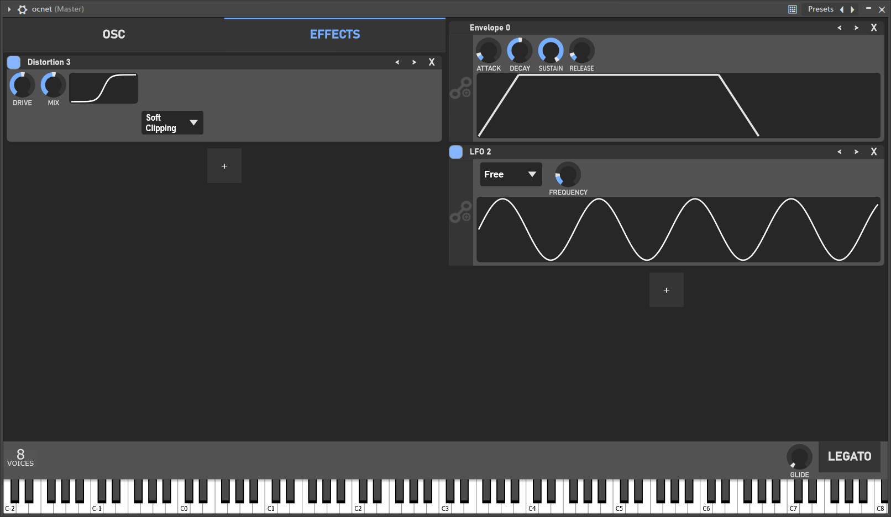

# OCNET

  
  

**OCNET** is a free, digital, modular, and easy-to-use synthesizer designed to provide both experienced and beginner music producers with a free modular alternative to the commercial options currently available on the market. It includes the essential features every synthesizer needs to create unique sounds in a creative and versatile way. Each module has been implemented with a focus on both quality and efficiency.

This project is my final year Computer Science project at the University of A Coruña (UDC).

## License

This project is licensed under the **GNU Affero General Public License, version 3 (AGPLv3)**. For more details, see the [LICENSE](./LICENSE.md) file.
